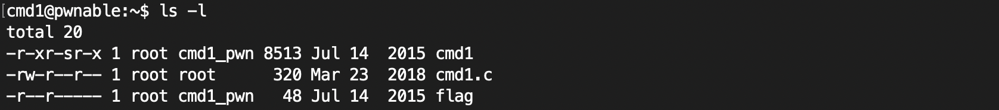
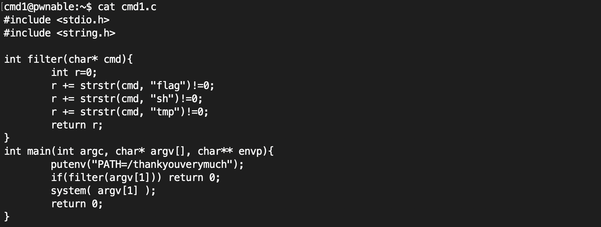
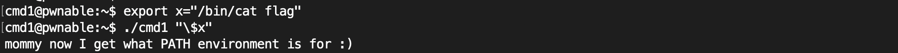
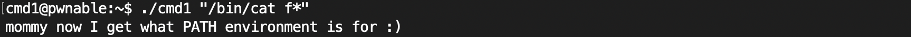

# Cmd1 Problem      
     
### Problem URL: <https://pwnable.kr/play.php> <br> 
### [Level: Toddler's Bottle]       

<hr/> 

```    
Mommy! what is PATH environment in Linux?

ssh cmd1@pwnable.kr -p2222 (pw:guest)   
```   

우선 어떤 파일이 존재하는지 확인해보면, 아래 사진과 같이 파일들이 구성됨을 알 수 있다.    


    
다음 소스코드를 확인해보자.   
    
   
    
이와 같이 입력을 받아서 System 함수를 Call 하는 것을 볼 수 있다.  
<strong>/bin/cat flag</strong> 명령이 System 함수에서 실행되면 Flag를 획득할 수 있을 것 같다.    
하지만, filter 함수에서 <strong>flag, sh, tmp</strong> 라는 단어들을 필터링하고 있기에,    
이를 우회해준다면 문제를 해결할 수 있다.   
    
해당 서버에 들어오기 전에 <strong>Mommy! what is PATH environment in Linux?</strong>이라는 문구가 있다.   
이는 환경변수를 활용하면 된다는 힌트임을 알 수 있다.   
그리하여, 환경변수를 아래와 같이 지정해준 후, 이를 입력 값으로 넣어준다면 문제를 해결할 수 있다.   
```    
export x="/bin/cat flag"
```     
    
이후, 아래와 같이 이를 입력해주면, 문제가 해결된다.    
    
   
    
이러한 방식 외에 이를 우회하는 방법은 *(wildcard)를 이용하는 방식이 있다.  
     
   
    

