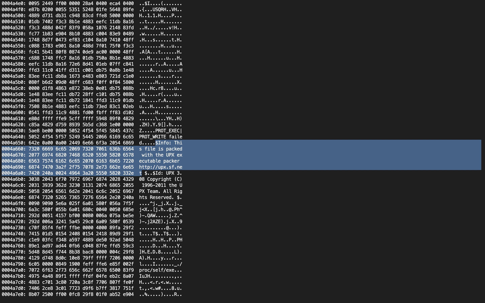
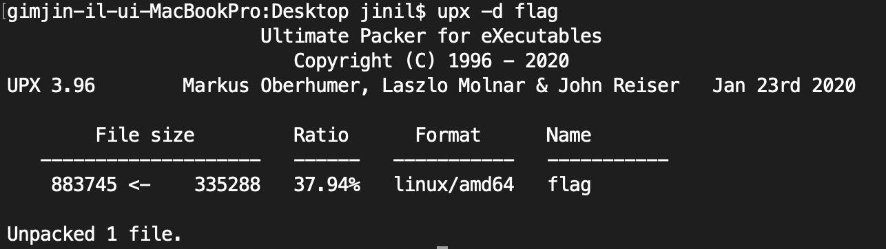
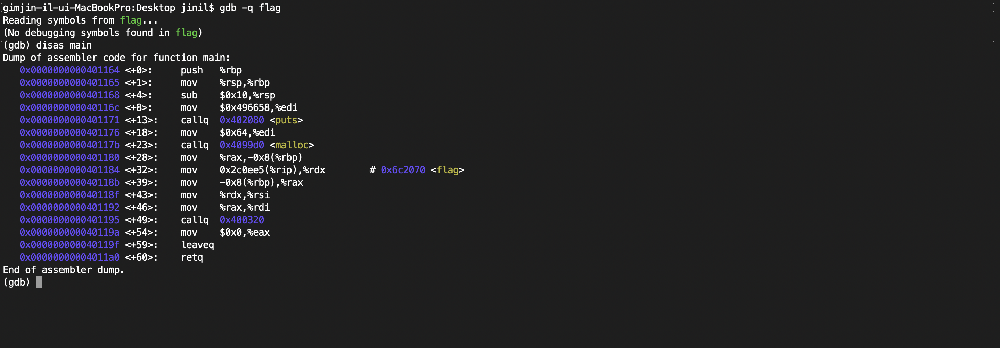
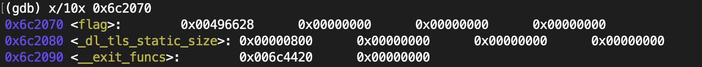
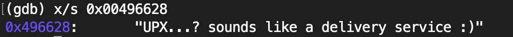

# Flag Problem      
     
### Problem URL: <https://pwnable.kr/play.php> <br> 
### [Level: Toddler's Bottle]       

<hr/>   

### Problem Download    
```
wget http://pwnable.kr/bin/flag    
```    

flag 파일을 다운받은 후, ./flag 명령을 통해 파일을 실행하려고 하면 실행이 안될 것이다.  
```
chmod +x flag   
```    
명령을 통해 실행 권한을 주게 되면, flag 파일을 실행할 수 있게 된다. 
이를 실행하게 되면, <strong>"I will malloc() and strcpy the flag there. take it."</strong> 이라는 문자열을 출력하게 된다.   
Reversing을 위해, <strong>gdb flag</strong> 명령 후, <strong>disas main</strong> 명령을 입력하니.  
어셈블리 코드를 출력하지 않는 것을 확인할 수 있습니다.     

```
이러한 경우에는 파일이 손상되었거나 암호화(또는 패킹)로 인해 읽지 못하는 경우입니다. 
```     
이를 통해, 파일이 패킹되어 있거나 파일이 손상되었음을 알게 되었다.    
```
xxd flag
```   
명령을 통해, 조금 더 분석해보도록 하자.   
이를 분석해본 결과, 아래와 같은 문구가 적혀있는 것을 확인할 수 있다.   
   


```     
"This file is packed with the UPX executable packer http://upx.sf.net"    
```    
이것은 UPX로 패킹되어있다는 것을 말해준다. 그리하여, 이를 언패킹해보도록 하자.   
우선 UPX를 언패킹해주기 위해, 아래 명령을 통해 다운로드하자.    
```
brew install upx     
```   
    
설치가 마무리 되었다면, 아래 명령을 입력해준다.    
    
```
upx -d flag   
``` 
    
사진과 같이 언패킹되었음을 확인할 수 있다.       
위 작업이 모두 마무리되었다면, gdb를 통해 분석해준다.     
```
gdb -q flag 
disas main        
```            

    

위 코드를 C 언어 형태로 바꿔보면, 아래와 같이 바꿀 수 있다는 것을 알 수 있다.      
````
int main(){    
     puts("I will malloc() and strcpy the flag there. take it.");  // puts(*0x496658);  
     rdi = malloc(0x64); 
     rsi = *0x6c2070; 
     strcpy(rdi, rsi);      
     
     return 0;     
}     
````  
   
### 단, 어셈블리 코드를 분석할 때, GAS 문법과 다르기 때문에 왼쪽에서 오른쪽으로 해석을 해야한다.    
    
```     
즉, mov %rdx, %rsi  // %rsi 레지스터에 %rdx 레지스터가 가진 값을 넣는다는 넣는다는 의미   
```    

어셈블리 코드를 보면, <flag> 라고 적힌 부분을 볼 수 있다.   
이때, <strong>rip = 0x0000000000401184</strong> 값을 저장하고 있음을 알 수 있다.    

<strong>0x2c0ee5(%rip)</strong>은 <strong>rip + 0x2c0ee5</strong>를 가리키는 포인터이다.     
그러므로, 주소 값을 계산하면, 아래와 같이 나오게 된다.     
    
```     
즉, 0x2c0ee5 + 0x0000000000401184 = 0x6c2070 위치에 flag 값 존재    
```      

이제 주소 값 위치를 알았으니, 어떤 값을 가지고 있는지 확인해보자.       
### 메모리 상태 검사   
``` 
x/[범위][출력 형식][범위 단위] [메모리주소나 함수명]       
```     

위 문법을 참고하여, 아래와 같이 입력해준다.      
     
```
x/10x 0x6c2070     
```  
    
    
위사진을 통해, 0x00496628 위치에 flag 가 존재함을 알 수 있다.     
그리하여, <strong>x/s 0x00496628</strong>를 입력해주면 아래와 같이 flag가 출력된다.      
      
      

