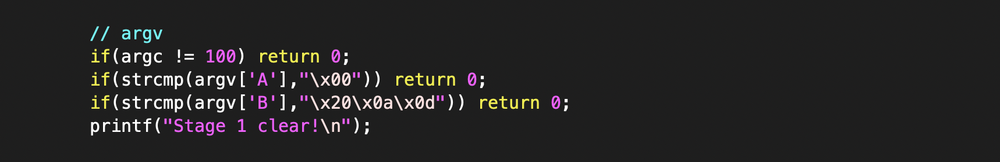
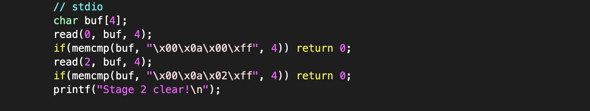
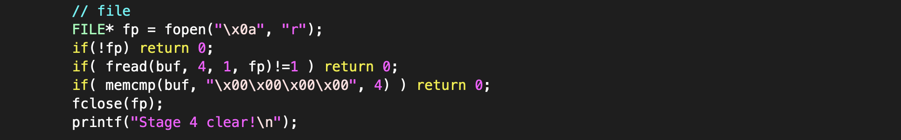
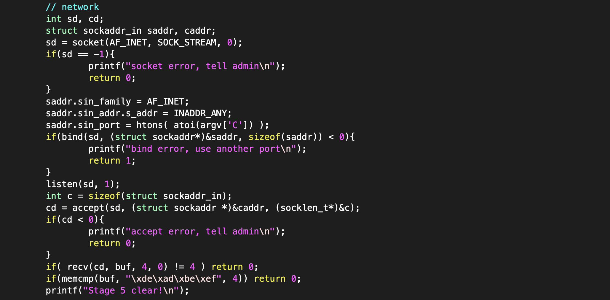

# Input Problem      
     
### Problem URL: <https://pwnable.kr/play.php> <br> 
### [Level: Toddler's Bottle]       

<hr/>  

우선 소스 코드를 보면, 아래와 같이 5단계에 걸쳐서 통과 여부를 체크한다.     
    
```
int main(int argc, char* argv[], char* envp[]){
	printf("Welcome to pwnable.kr\n");
	printf("Let's see if you know how to give input to program\n");
	printf("Just give me correct inputs then you will get the flag :)\n");

	// argv
	if(argc != 100) return 0;
	if(strcmp(argv['A'],"\x00")) return 0;
	if(strcmp(argv['B'],"\x20\x0a\x0d")) return 0;
	printf("Stage 1 clear!\n");	

	// stdio
	char buf[4];
	read(0, buf, 4);
	if(memcmp(buf, "\x00\x0a\x00\xff", 4)) return 0;
	read(2, buf, 4);
        if(memcmp(buf, "\x00\x0a\x02\xff", 4)) return 0;
	printf("Stage 2 clear!\n");
	
	// env
	if(strcmp("\xca\xfe\xba\xbe", getenv("\xde\xad\xbe\xef"))) return 0;
	printf("Stage 3 clear!\n");

	// file
	FILE* fp = fopen("\x0a", "r");
	if(!fp) return 0;
	if( fread(buf, 4, 1, fp)!=1 ) return 0;
	if( memcmp(buf, "\x00\x00\x00\x00", 4) ) return 0;
	fclose(fp);
	printf("Stage 4 clear!\n");	

	// network
	int sd, cd;
	struct sockaddr_in saddr, caddr;
	sd = socket(AF_INET, SOCK_STREAM, 0);
	if(sd == -1){
		printf("socket error, tell admin\n");
		return 0;
	}
	saddr.sin_family = AF_INET;
	saddr.sin_addr.s_addr = INADDR_ANY;
	saddr.sin_port = htons( atoi(argv['C']) );
	if(bind(sd, (struct sockaddr*)&saddr, sizeof(saddr)) < 0){
		printf("bind error, use another port\n");
    		return 1;
	}
	listen(sd, 1);
	int c = sizeof(struct sockaddr_in);
	cd = accept(sd, (struct sockaddr *)&caddr, (socklen_t*)&c);
	if(cd < 0){
		printf("accept error, tell admin\n");
		return 0;
	}
	if( recv(cd, buf, 4, 0) != 4 ) return 0;
	if(memcmp(buf, "\xde\xad\xbe\xef", 4)) return 0;
	printf("Stage 5 clear!\n");

	// here's your flag
	system("/bin/cat flag");	
	return 0;
}
```  
      
### 첫 단계 

   
    
이 부분을 보면, arguments 개수가 100개를 만족해야하고, argv['A'] 값이 '\x00'이며,   
argv['B']값이 '\x20\x0a\x0d'임을 만족해야 Stage1을 클리어 할 수 있다.    

#### 이때, argv['A'] = argv[65] , argv['B'] = argv[66] 의미  


### 두 번째 단계 

    
    
위 사진을 보면, read 함수를 통해 읽어서 memcmp 함수를 통해 비교하는 것을 알 수 있다.    
read( 0, , ); 은 stdin을 의미하고, read(2, , );은 stderr 의미하기에,   
stdin으로 '\x00\x0a\x00\xff' 값을 전달하고, stderr 로'\x00\x0a\x02\xff' 값을 전달해주면,    
Stage2를 클리어 할 수 있다.     

### 세 번째 단계   

  
     
getenv() 함수는 해당 환경변수 값을 가져오는 역할을 한다. 그렇기에, '\xde\xad\xbe\xef'에    
환경변수 값 '\xca\xfe\xba\xbe'을 지정해주면 해결할 수 있다.   

### 네 번째 단계  

 

이번 단계는 '\x0a'라는 이름의 파일에 첫 번째줄에 4 byte ('\x00\x00\x00\x00')이 쓰여있는지   
확인하는 단계이다. 즉, '\x0a' 파일을 연후 '\x00\x00\x00\x00'를 써주면 이를 해결할 수 있다.    
    
### 다섯 번째 단계  
    
    
   
이번 단계는 네트워크 부분이다. 링크: <https://rotapple.tistory.com/8> 
우선 코드를 해석이 힘들다면, 먼저 위 링크를 통해 내용을 숙지하자.    
   
천천히 해석해보면, IPv4, TCP로 소켓을 생성한 후, SOCKADDR_IN 구조체를 통해  
소켓 통신에 사용할 주소와 포트번호를 저장한다. 
    
#### 단, 이떄 atoi(argv['C']) 값을 port 번호로 지정해준다.  

bind 함수를 통해 주소를 지정할 소켓을 정해준 후, listen() 함수를 통해 접속을 기다린다.   
listen() 함수를 통해 클라이언트의 연결을 감지하게 되면, accept() 함수로 넘어온다.   
이후, sd 라는 소켓에서 연결 요청이 들어온 주소는 caddr 구조체에, 연결 요청이 들어온 클라이언트와   
연결할 수 있는 소켓은 함수의 반환을 통해 cd 로 전달된다.  

이를 통해, 우리는 PORT 번호에 '\xde\xad\xbe\xef' 값을 전달해야함을 알 수 있다.  
위 과정을 모두 마무리하면, Flag 를 획득할 수 있다.  
     
#### 만일 쓰기 권한이 있는 다른 곳에서 작업을 한다면, 심볼릭 링크를 걸어주어야 한다.    
```   
ln -s /home/input2/flag flag
```   

이제 익스플로잇 코드를 작성해보면, pwntool을 사용하여 attack.py 과 같이 작성할 수 있다.  
결론적으로, 파이썬 코드를 실행시켜주면 Flag 를 획득할 수 있다.      

Flag: Mommy! I learned how to pass various input in Linux :)  
 
