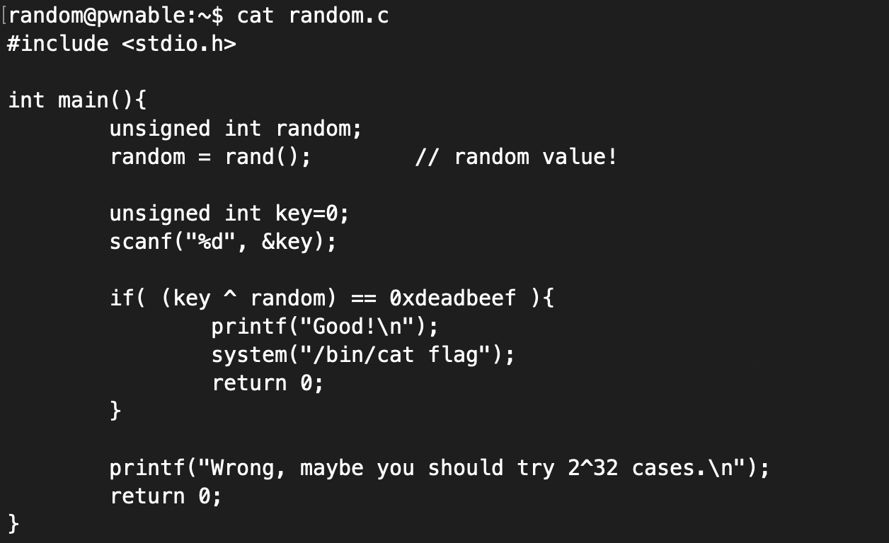
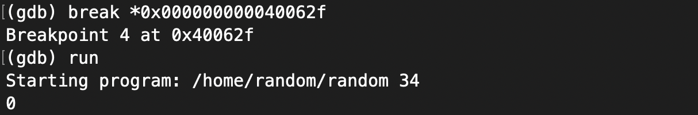
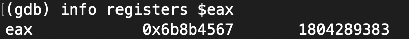
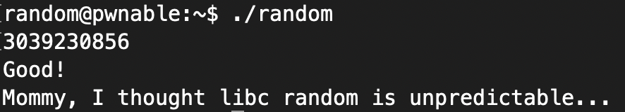

# Random Problem      
     
### Problem URL: <https://pwnable.kr/play.php> <br> 
### [Level: Toddler's Bottle]       

<hr/>    
   
### 접속 방법  
아래 명령을 통해, 서버에 접속해준다.   
```    
ssh random@pwnable.kr -p2222 (pw:guest) 
```  

우선 코드를 살펴보자.   
   
     
이와 같이, rand() 함수의 값과 Key 값을 XOR 연산하여 0xdeadbeef 와 같은 값을 가져야함을 알 수 있다.   
이떄 rand() 함수를 자세히 살펴보면, 매번 바뀌는 시드 값이 설정되어 있지 않은 것을 확인할 수 있다.   
그리하여, rand() 함수에서 반환하는 값을 알아낸다면, 이를 해결할 수 있을 것 같다.   
      
우선 GDB를 통해 분석해보자.     
``` 
gdb -q ./random     
disas main    
```   
    
위 명령을 입력해주면, 아래와 같은 화면을 확인할 수 있다.      
    
   

어셈블리 코드를 자세히보면, cmp 라는 것을 볼 수 있는데 이는 비교 연산 역할을 한다.   
     
```    
0x000000000040062f <+59>:	cmp    $0xdeadbeef,%eax    
```    

이 코드를 보면, 0xdeadbeef와 %eax의 값이 동일하면, if 문을 통과한다는 것을 알 수 있다.    
그렇기에 아래와 같이, break를 걸어 %eax 값을 알아보자.      
     
    
      
#### 단, 이때 입력 값을 0으로 입력해준 이유는 0과 xor 연산을 하게되면random 값을 알아낼 수 있기 때문이다.     
     
위 과정을 거친 후, 아래 명령을 통해 %eax register 가 가진 값을 확인해보면 아래와 같다.   
     
```     
info registers $eax    
```    
     
    
     
#### 즉, %eax 값이 0x6b8b4567 임을 알 수 있다.    

그럼, 이제 XOR 연산을 해주면 된다.    

``` 
(입력 값) ^ ( 0x6b8b4567 ) == 0xdeadbeef 
```      
     
입력 값을 알아내기 위해서는 동일한 방식으로 0x6b8b4567 ^ 0xdeadbeef 연산을 해주면, 값을 알 수 있다.    
   
```   
0x6b8b4567 ^ 0xdeadbeef = 0xdeadbeef (= 3039230856) 
```    

    
    
이와 같이Flag를 획득할 수 있다.    

 


