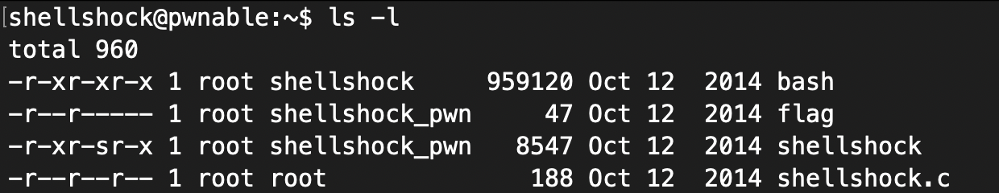
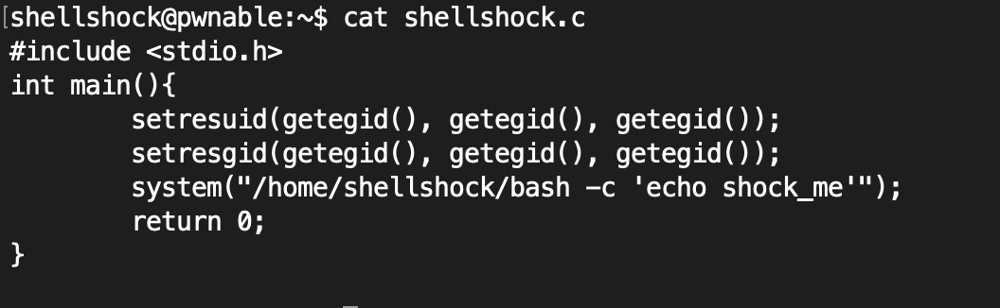
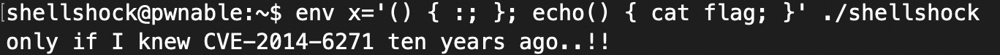

# ShellShock Problem 

### Problem URL: <https://pwnable.kr/play.php> <br> 
### [Level: Toddler's Bottle]     

<hr/>     

## ShellShock      

## Bash Vulnerability(CVE-2014-6271)
`````     
정의: GNU bash shell에서 환경변수를 통해 공격자가 원격으로 명령어를 실행할 수 있는 취약점     
<br> 
2014년 9월 24일, GNU Bash 환경변수를 통한 코드 인젝션 취약점이 보고되었다. 이른바 ‘쉘쇼크(ShellShock)’로 불리는 해당 취약점환경변수를 이용하여 인젝션을 시도할 수 있어 공격자는 악의적인 명령이 포함된, 특별하게 조작된 환경변수를 사용하여 해당 취약점을 이용해 악의적인 행위를 수행할 수 있다.
`````      
## 1. bash 취약점 확인 방법   
```
env x='(){ :; }; echo ATTACK'    
```    

### env command   
```
현재 지정되어 있는 환경 변수들을 출력하거나, 새로운 환경 변수를 설정하고 적용된 내용을 출력하는 명령어
```  

### x = (함수명){ 수행 코드 };  

이와 같이, 환경 변수를 지정할 수 있다. 그렇기에, 정상적인 동작이 이루어진다면, 위에서 입력했던 echo ATTACK 명령이 오류를 발생시키거나 실행되어서는 안된다.   
하지만, ShellShock 취약점을 가진 쉘은 echo ATTACK 명령을 실제로 수행시켜 문제를 일으킨다.  

## 문제 풀이  

ls -l 명령을 통해 파일 4 개가 존재함을 알 수 있다.   
    
  

그럼 우선 C Source Code가 어떻게 구성되어 있는지 살펴보자.    
    
   

코드를 살펴보면, System 함수를 통해 /home/shellshock/bash -c 'echo shock_me' 명령을 실행시키는 것을 볼 수 있다.   
shellshock 실행 파일을 실행시키면, echo shock_me 명령이 실행된다는 것을 알 수 있다.  

그럼 우선 ShellShock 테스트를 해보면, 아래와 같이 테스트가 잘 이루어지는 것을 볼 수 있다. 
   
     
   


