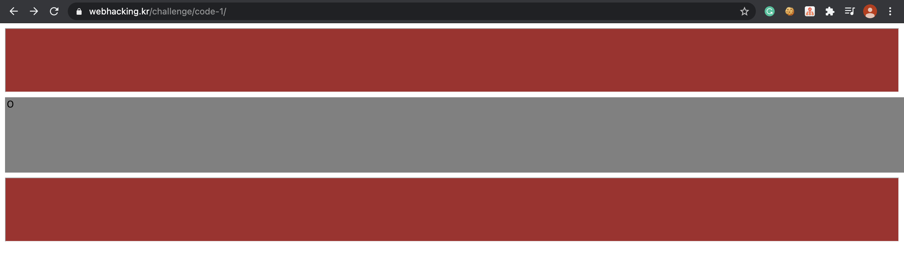
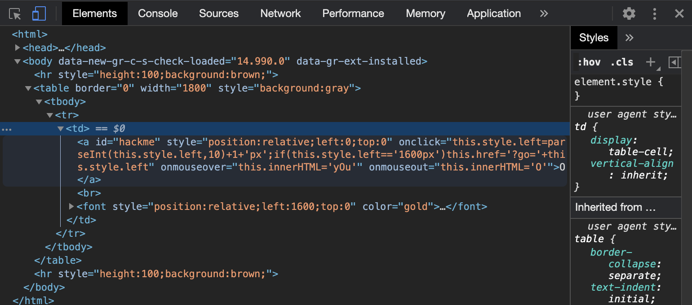
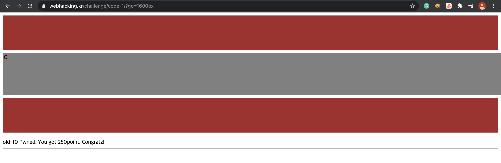

Problem10
===========   

This problem is in webhacking.kr.   
URL: <https://webhacking.kr/challenge/code-1//>   
 
If you enter in the URL, you can see like the bottom photo.   
      
   

### First, View Source

```
<html>
<head>
<title>Challenge 10</title>
</head>

<body>
<hr style=height:100;background:brown;>
<table border=0 width=1800 style=background:gray>
<tr><td>
<a id=hackme style="position:relative;left:0;top:0" onclick="this.style.left=parseInt(this.style.left,10)+1+'px';if(this.style.left=='1600px')this.href='?go='+this.style.left" onmouseover=this.innerHTML='yOu' onmouseout=this.innerHTML='O'>O</a><br>
<font style="position:relative;left:1600;top:0" color=gold>|<br>|<br>|<br>|<br>Goal</font>
</td></tr>
</table>
<hr style=height:100;background:brown;>
</body>
</html>
```

The HTML of the page is composed like this. If you look closely at this code, you can look at this.  
```
if(this.style.left=='1600px')this.href='?go='+this.style.left"   
```   
   
This code is included in <strong>a tag</strong>. In addition, you can know that <strong>the ID of A tag</strong> is "hackme".
Thus, we should change the value of "this.style.left" to '1600px'.   
    
To manipulate it, opens the developer tool window. 

   
    
Then, Modify the code like this.     
    
<strong>(Before)</strong> 
onclick="this.style.left=parseInt(this.style.left,10)+1+'px';  
  
<strong>(After)</strong>   
onclick="this.style.left=1600+'px';    
   
After modifying like this, click 'O' of the page.  
Then, you can get the point of problem 10.   
     
   
    


   
