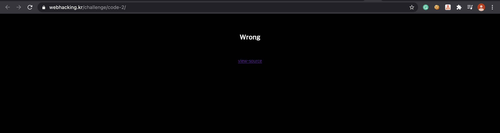
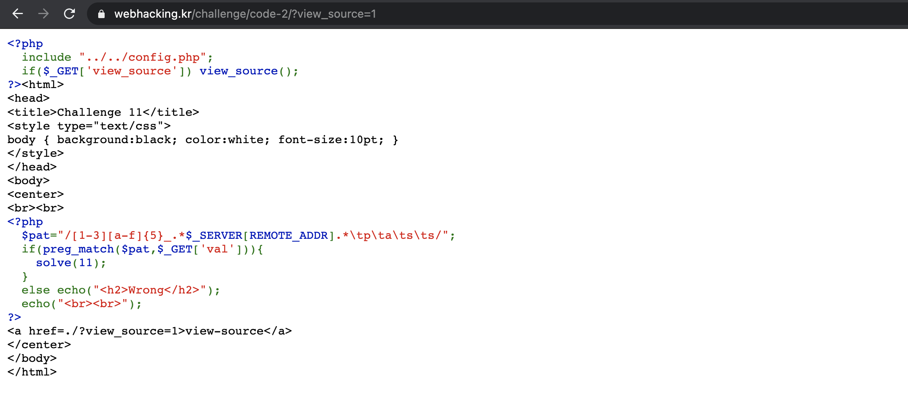
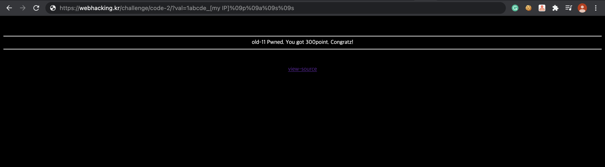

Problem11
===========   

This problem is in webhacking.kr.   
URL: <https://webhacking.kr/challenge/code-2//>   
 
If you enter the URL, you can see the below photo.   
      
 

### First, View Source   
   
   
    
If you look at the code, you can see this part.   
    
```   
<?php
  $pat="/[1-3][a-f]{5}_.*$_SERVER[REMOTE_ADDR].*\tp\ta\ts\ts/";
  if(preg_match($pat,$_GET['val'])){
    solve(11);
  }
  else echo("<h2>Wrong</h2>");
  echo("<br><br>");
?>
```    
  
You can know that you can solve the problem if the value of $val sent through "Get Method" is the same as the $pat.   
Let's analyze the code.   
    
```
/[1-3][a-f]{5}_.*$_SERVER[REMOTE_ADDR].*\tp\ta\ts\ts/
```    
    
#### [1-3][a-f]{5}: (1~3)(the five characters among (a~f)) 
#### *$_SERVER[REMOTE_ADDR]: [Your IP Address] (More than 0)      
IP link: <https://www.findip.kr//>   
#### *\tp\ta\ts\ts/: (\t == %09) (More than 0)   

Thus, we can manipulate the value of $val like below through this.   
    
```   
$val = 1abcde_[Your IP]%09p%09a%09s%09s   
```    
    
If you enter the URL like this, you can solve the problem.    
    
```    
https://webhacking.kr/challenge/code-2/?val=1abcde_[Your IP]%09p%09a%09s%09s   
```    
     
   
    


                  
