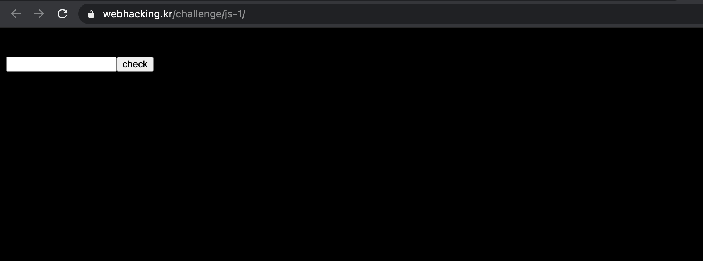
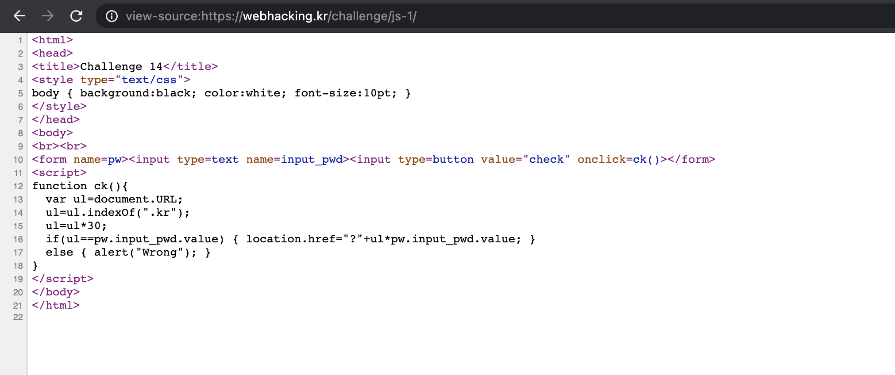
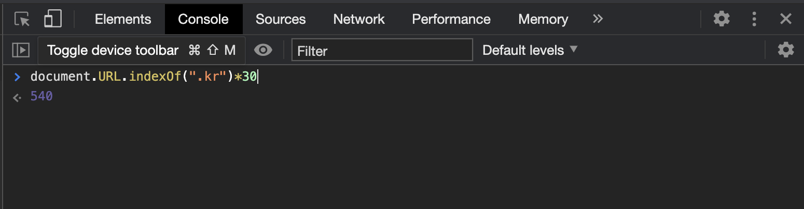
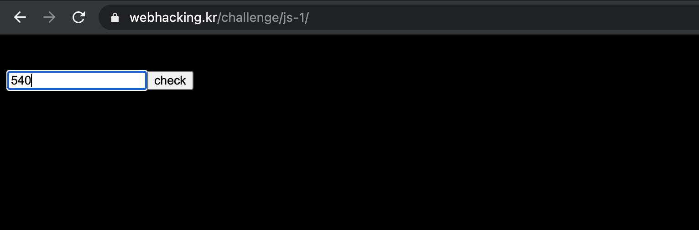

Problem14
===========   

This problem is in webhacking.kr.   
URL: <https://webhacking.kr/challenge/js-1//>   
 
If you enter the URL, you can see the below photo.   
      
 

### First, View Source   
   
   
    
If you look at the code, you can see this part.  
    
``` 
if(ul==pw.input_pwd.value) { location.href="?"+ul*pw.input_pwd.value; }   
```    

Thus, we can know that the value of "ul" through this method.   
     
    
    
In conclusion, if you enter 50 in the input tag, you can solve the problem.   
     
    
    
 
