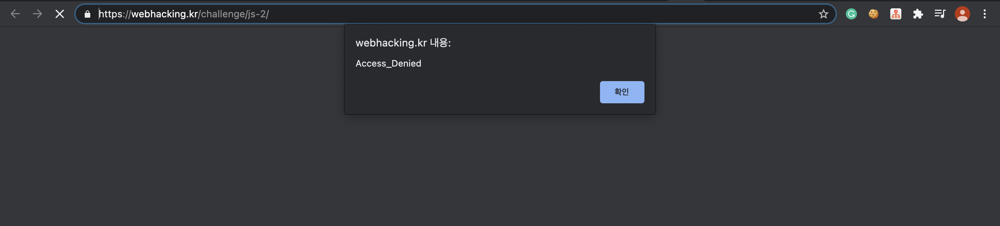
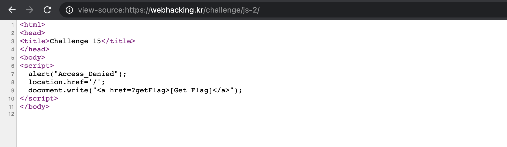

Problem15
===========   

This problem is in webhacking.kr.   
URL: <https://webhacking.kr/challenge/js-2//>   
 
If you enter the URL, you can see the below photo.   
      
 

### First, View Source   
   
   
    
If you look at the code, you can see this part.
    
```    
document.write("<a href=?getFlag>[Get Flag]</a>");    
```    

Thus, if you enter the URL like this, you can solve the problem.   
   
```  
https://webhacking.kr/challenge/js-2/?getFlag   
```    
    

