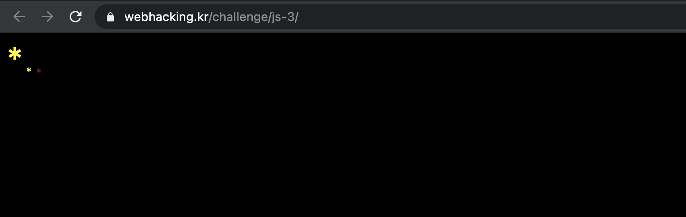
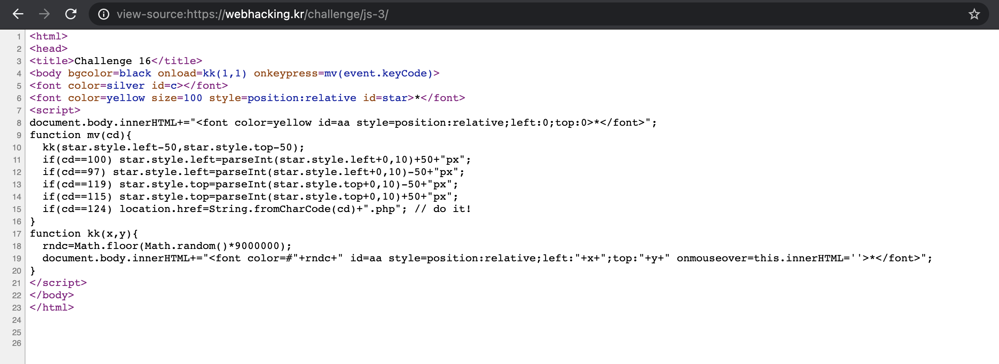

Problem16
===========   

This problem is in webhacking.kr.   
URL: <https://webhacking.kr/challenge/js-3//>   
 
If you enter the URL, you can see the below photo.   
      
 

### First, View Source   
   
   
    
If you look at the code, you can see this part.  
    
```   
if(cd==124) location.href=String.fromCharCode(cd)+".php"; // do it!    
```    
    
If you move the <strong>String.fromCharCode(cd)+".php";</strong>, you will solve the problem.    
To get the value of "String.fromCharCode(124)", you can try to like this.    
    
   
     
<strong>String.fromCharCode(124) -> "|"</strong>    
     
If you enter this URL, you can solve the problem.    
    
```  
https://webhacking.kr/challenge/js-3/|.php   
```     

