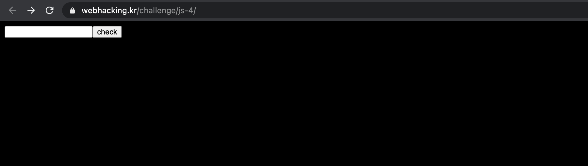
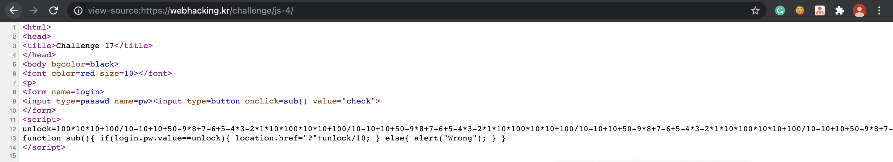
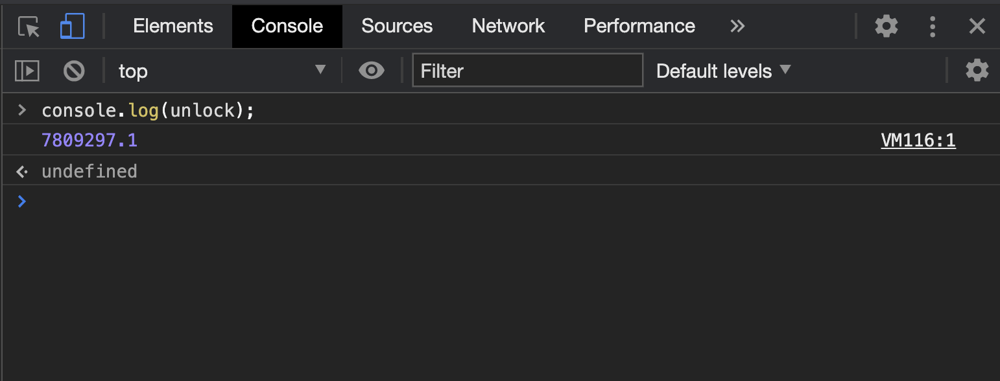
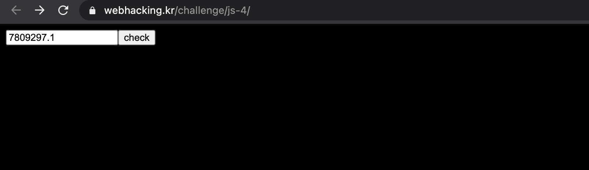

Problem17
===========   

This problem is in webhacking.kr.   
URL: <https://webhacking.kr/challenge/js-4//>   
 
If you enter the URL, you can see the below photo.   
      
 

### First, View Source   
   
  
     
```  
<html>
<head>
<title>Challenge 17</title>
</head>
<body bgcolor=black>
<font color=red size=10></font>
<p>
<form name=login>
<input type=passwd name=pw><input type=button onclick=sub() value="check">
</form>
<script>
unlock=100*10*10+100/10-10+10+50-9*8+7-6+5-4*3-2*1*10*100*10*10+100/10-10+10+50-9*8+7-6+5-4*3-2*1*10*100*10*10+100/10-10+10+50-9*8+7-6+5-4*3-2*1*10*100*10*10+100/10-10+10+50-9*8+7-6+5-4*3-2*1*10/100*10*10+1/10-10+10+50-9*8+7-6+5-4*3-2*1*10*100*10*10+100/10-10+10+50-9*8+7-6+5-4*3-2*1*10+100*10*10+100/10-10+10+50-9*8+7-6+5-4*3-2*1*10-100*10*10+100/10-10+10+50-9*8+7-6+5-4*3-2*1*10/100*10*10+100/10-10+10+50-9*8+7-6+5-4*3-2*1*10/100*10*10+100/10-10+10+50-9*8+7-6+5-4*3-2*1*10/100*10*10+100/10-10+10+50-9*8+7-6+5-4*3-2*1*10/100*10*10+100/10-10+10+50-9*8+7-6+5-4*3-2*1*10/100*10*10+100/10-10+10+50-9*8+7-6+5-4*3-2*1*10/100*10*10+100/10-10+10+50-9*8+7-6+5-4*3-2*1*10/100*10*10+100/10-10+10+50-9*8+7-6+5-4*3-2*1*10/100*10*10+100/10-10+10+50-9*8+7-6+5-4*3-2*1*10/100*10*10+100/10-10+10+50-9*8+7-6+5-4*3-2*1*10*100*10*10+100/10-10+10+50-9*8+7-6+5-4*3-2*1*10*100*10*10+100/10-10+10+50-9*8+7-6+5-4*3-2*1*10*100*10*10+100/10-10+10+50-9*8+7-6+5-4*3-2*1*10*100*10*10+100/10-10+10+50-9*8+7-6+5-4*3-2*1*10*100*10*10+100/10-10+10+50-9*8+7-6+5-4*3-2*1*10*100*10*10+100/10-10+10+50-9*8+7-6+5-4*3-2*1*10*100*10*10+100/10-10+10+50-9*8+7-6+5-4*3-2*1*10+9999999;
function sub(){ if(login.pw.value==unlock){ location.href="?"+unlock/10; } else{ alert("Wrong"); } }
</script>
```   
    
you can do like this to get the value of "unlock".    
   
```   
console.log(unlock); 
```    
   
    
     
If you enter the value on the input tag, you can solve the problem.   
    
    
     

