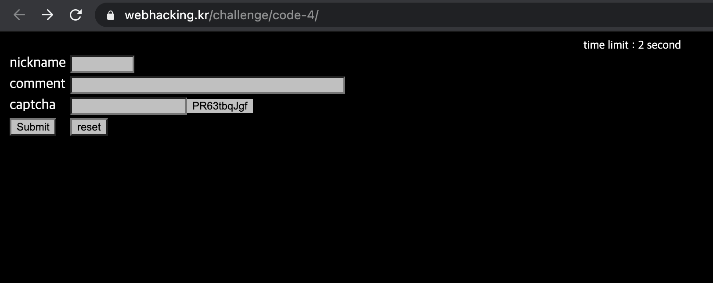
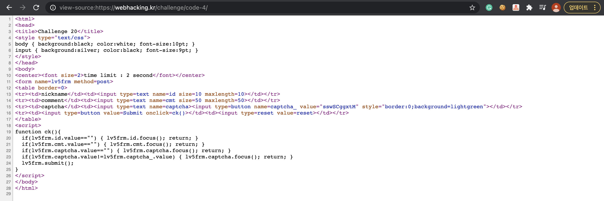
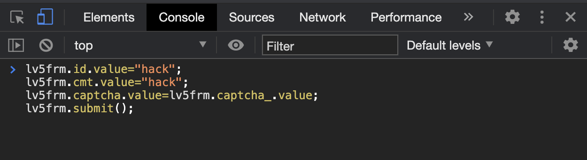
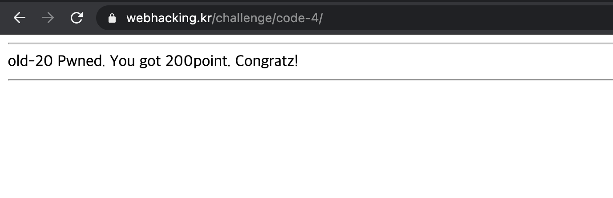

Problem20
===========   

This problem is in webhacking.kr.   
URL: <https://webhacking.kr/challenge/code-4///>   
 
If you enter the URL, you can see the below photo.   
      
 

### First, View Source   
   
   
    
If you look at the code, you can see this part.   
   
```   
function ck(){
  if(lv5frm.id.value=="") { lv5frm.id.focus(); return; }
  if(lv5frm.cmt.value=="") { lv5frm.cmt.focus(); return; }
  if(lv5frm.captcha.value=="") { lv5frm.captcha.focus(); return; }
  if(lv5frm.captcha.value!=lv5frm.captcha_.value) { lv5frm.captcha.focus(); return; }
  lv5frm.submit();
}   
```   
    
This code shows that if you does not enter the value, the page focus on the specific input tag.    
But, it says on the first page that you will give 2 seconds to submit.   
Thus, this problem cannot solve to the direct input method.  
   
To solve the problem, you can use this method.   
    
    
        
It is to give a value in advance to the page.   
As a result, you can solve the problem like this.    
    
    
    
