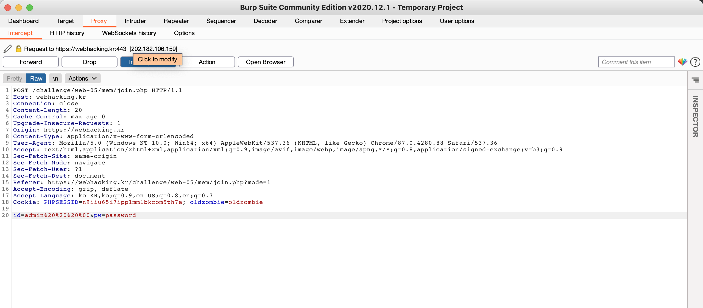

##Problem5   

This problem is in webhacking.kr.   
URL: https://webhacking.kr/challenge/web-05/   
 
If you enter in the URL, you can see like the bottom photo.    
   

First of all, let's go to the login page. Then, the join button is just alert function.    
You can just see the alert function if you see the source code of web page.      

First, let's enter the id and password to 'admin' & 'admin'.    
If you enter these, you can see like the bottom photo.   
    

Then, How can you join?     
The method is that you enter the URL (https://webhacking.kr/challenge/web-05/mem/join.php)    
If you enter the page, the page shows like the bottom photo. 
    

Then, let's analyze the source code of the page.     
If you see the source code, it is like the bottom photo.     
    

We should decode the source code to solve the problem.     
I made the decoder to python code. If you run the python source code, you can confirm the decoded web source code.    
Thus, the result is same with bottom photo. 
     

##Conditions      

The first condition means that the cookie value named "oldzombie" should exist in the cookie.    
The second condition means that mode=1 should exist in the URL.     
If you satisfy the two conditions, you could in the page.     

1. First Condition     
     

After entering that the first condition is complete, the page shows like the bottom photo.     
    
  
2. Second Condition     
URL: you sholud include "?mode=1" behind the original url.     
     

##Join    
Thus, the page shows the join page. But, if you try to join with id named 'admin', the page will inform you to "'admin' is already existing id".       
So, after using the proxy tool, you should add the whitespace & null character behind the entered ID like the bottom photo.     
     

Then, you could join the ID named 'admin'.      
      

##Login     
     
     
     

